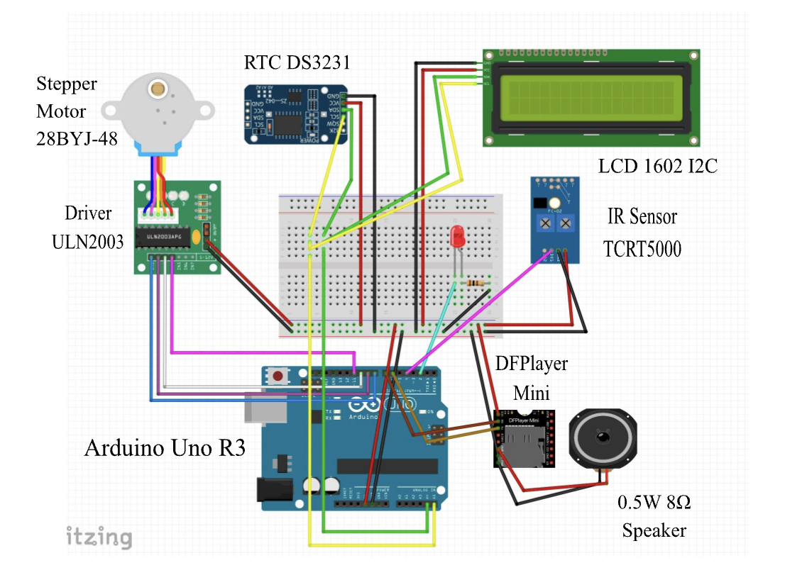

# 🔌 Circuit & Wiring

This folder contains the wiring diagram for AutoDose.

The diagram was made in Fritzing and shows how the Arduino Uno connects to the sensors, display, RTC, stepper motor, and DFPlayer Mini.

## Pin Connections

| Component | Pin | Arduino Uno |
|---|---|---|
| ULN2003 | IN1 | D8 |
| ULN2003 | IN2 | D9 |
| ULN2003 | IN3 | D10 |
| ULN2003 | IN4 | D11 |
| TCRT5000 | OUT | D4 |
| LED | Anode (+) | D2 |
| DFPlayer Mini | RX | D7 |
| DFPlayer Mini | TX | D6 |
| DS3231 | SDA | A4 |
| DS3231 | SCL | A5 |
| LCD 1602 I2C | SDA | A4 |
| LCD 1602 I2C | SCL | A5 |

The DS3231 and LCD both use I2C, so they share the same SDA and SCL pins.

## Power

The modules are powered from the Arduino's 5V and GND connections. Make sure all modules share a common ground.

The 28BYJ-48 stepper motor is connected through the ULN2003 driver board rather than directly to the Arduino.

## Notes

The wiring shown here is based on the version of AutoDose I built for the VoltHacks Hackathon 2026. If you are rebuilding it yourself, double-check the pin connections against the Arduino code before powering everything on.
